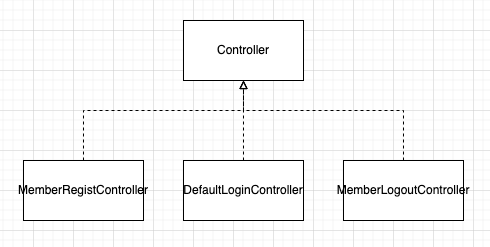
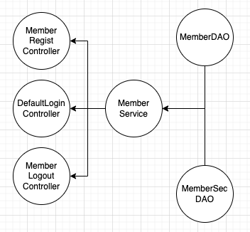

# 프로그램 한 줄 소개
XML 파일 안에 담겨 있는 Controller, Service, DAO에 대한 의존성 정보를 읽고 프로그램 실행 시에 자동으로 의존성을 주입하는 Java EE 프로그램 개발 (Spring Framework 모사)

# 프로그램의 특징 
- XML 파일 안에 적혀 있는 의존성 정보를 읽고, 위상정렬 알고리즘을 사용해서 **자동으로 의존성을 주입합니다**. 
- **Front Controller 패턴에 따라** 하나의 Servlet이 모든 요청을 처리합니다. 

# 왜 개발했는가? 
- Java Spring의 작동원리를 이해하기 프로그램을 만들었습니다. Java Spring은 의존성을 주입함으로써 유연한 설계를 가진 웹 애플리케이션을 개발할 수 있게 합니다.
  
  - Spring이 정확히 어떤 원리를 통해 DI 를 해주는지 이해하기 위해 직접 DI 기능을 구현해보았습니다. 

- Java Spring은 단 하나의 Servlet을 가지고 있습니다. Spring MVC에서 모든 요청은 Dispatcher Servlet을 거쳐서 각 Controller로 전파됩니다. 

  - 이를 Front Controller 패턴이라고 하는데, 코드로 직접 구현해보며 개념을 이해하고자 하였습니다. 

---

# 자세한 설명
## Controller, Service, DAO 간 의존성 정보를 XML 파일로 입력 받아 자동으로 의존성을 주입하여 객체를 생성하는 DI 기능 구현
## 사용하는 알고리즘 
위상정렬
### 알고리즘 설명
위상정렬(Topological Sort)은 유향 그래프(directed graph)에서 정점(vertex)들의 순서를 결정하는 알고리즘입니다. 이 알고리즘은 DAG(Directed Acyclic Graph)에서만 사용 가능합니다. DAG는 사이클이 없는 유향 그래프입니다. <br>
위상정렬은 일반적으로 시간복잡도가 O(V+E)입니다. <br>
### 적용 서비스
여러 개의 Servlet을 만드는 대신 여러 Controller를 만든 후 XML 파일(beans.xml)에 해당 Controller 정보 (id, class)를 작성하였습니다. 이 XML 파일을 파서가 파싱하여 객체를 생성합니다. <br>
 <br>
저는 여기서 한 발 더 나아가 **Controller 뿐만 아니라 Service와 DAO 객체 정보**도 XML 파일에 기록한 후 파서가 파싱하여 객체를 생성하게 할 수는 없을까 고민했습니다. <br>
제가 생각한 아이디어를 간단하게 설명하면 다음과 같습니다. <br>
XmlBeanFactory 객체가 Controller, Service, DAO 정보 (ID, classname)을 파싱한 후 이를 beanMap에 저장합니다. <br>
Bean (=Controller, Service, DAO 정보) 객체에 의존관계도 기록합니다. 의존관계 정보란 이 Bean이 의존하는 객체가 무엇인지, 그리고 이 Bean을 의존하는 객체가 무엇인지에 대한 정보입니다. Bean들을 실제 객체로 생성하려면 의존관계 문제를 모두 해결해야 합니다. <br>

예를 들어 Controller를 생성하기 위해서는 그 Controller가 알고 있는(=의존하는) Service 객체를 먼저 Controller에 주입해야 합니다. 그리고 Service를 생성하기 위해서는 그 Service가 알고 있는(=의존하는) DAO 객체를 먼저 Service에 주입해야 합니다. Bean(=Controller, Service, DAO)을 차례대로 만들기 위해 필요한 알고리즘은 무엇일까요? <br>
바로 **위상정렬 알고리즘**입니다. <br>
<br>
(위 **그래프**의 엣지 방향은 클래스 다이어그램의 의존 방향과 정반대입니다. 그래야 진입 차수를 기준으로 전개해나가는 위상정렬 알고리즘을 적용할 수 있습니다.) <br><br>
의존관계를 Edge로 보고, 각 Bean (Controller, Service, DAO)를 정점으로 보면 하나의 그래프가 만들어집니다. 이 그래프에 위상정렬을 적용하여 정점들의 순서대로 객체를 생성함으로써 성공적으로 모든 객체를 만들 수 있습니다. <br>
이것이 제가 만든 프로그램의 기초적인 아이디어입니다.<br><br>

**XML 파일 위치** <br>
`WebContent/WEB-INF/web.xml` <br><br>

**XML 파일 형식** <br>
```xml
<!-- bean 정보 -->
<controller class="web.controller.member.MemberRegistController" id="member-regist"></controller>
<service class="web.model.service.MemberServiceImpl" id="member-service"></service>
<dao class="web.model.dao.MemberDAOImpl" id="member-dao"></dao>
<dao class="web.model.dao.MemberSecDAOImpl" id="membersec-dao"></dao>
<!-- 의존관계 정보 -->
<controllers>
    <controller id="member-regist">
      <service id="member-service">
        <dao id="member-dao"></dao>
        <dao id="membersec-dao"></dao>
      </service>
    </controller>
    <!-- ... -->
<controllers>
```
<br>
bean 정보 태그는 Bean(=Controller, Service, DAO)의 ID, class 를 알려줍니다.<br>
bean 간의 의존관계 정보를 알려주는 태그는 계층적으로 의존관계를 표시합니다. <br><br>

**XML 파일을 파싱하여 위상정렬 알고리즘을 적용한 뒤 객체를 생성하는 클래스**<br>
`src/main/java/web/controller/XmlBeanFactory.java` <br><br>
